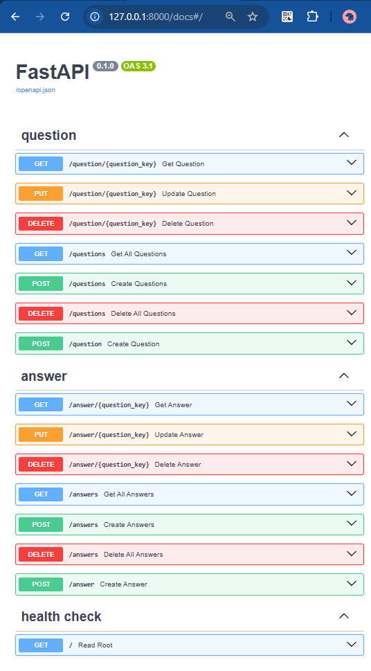

# Projeto API Python 

Projeto feito com a biblioteca FastAPI para consultar dados de questões armazenados no banco de dados em memória Redis.

## Configuração

1. **Criar container Redis**:
```sh
docker run -d --name meu-redis -p 6379:6379 redis
```

2. **Instalar dependências**:
```sh
pip install fastapi uvicorn redis
```

3. **Executar a aplicação**:
```sh
uvicorn main:app --reload --log-level info
```

## Endpoints

- **GET /**: Retorna uma mensagem de boas-vindas.

## Exemplo

Para testar a aplicação, execute o comando abaixo e acesse `http://127.0.0.1:8000` no seu navegador:

Para ver a documentação Swagger:  `http://127.0.0.1:8000/docs`



```sh
uvicorn main:app --reload
```

## Como executar

**Você pode utilizar a própria página do Swagger, clicar em "try it out" e inserir os dados dos parâmetros e body na própria página!**

## Coleção Postman

A coleção do Postman está na raiz do projeto: ./redis.postman_collection.json

## Como destruir o container Redis

Para remover o container Redis criado, execute o comando abaixo no terminal:

```sh
docker rm -f meu-redis
```
